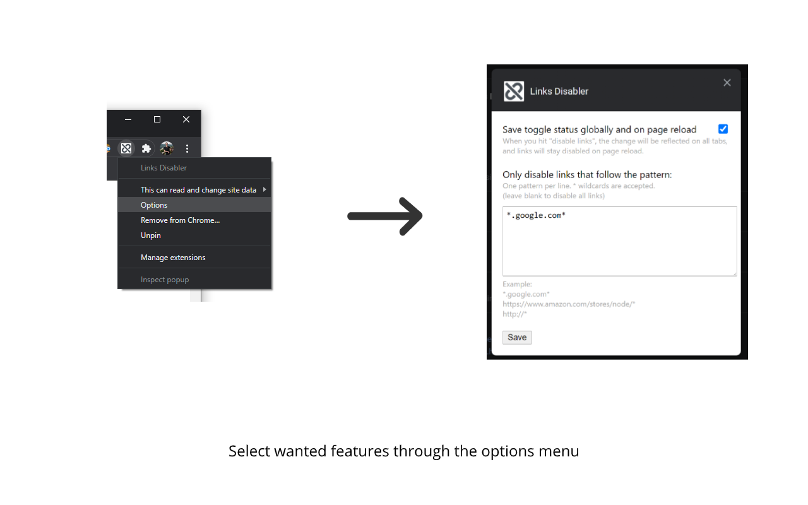

<p align="center">
</p>
<h1 align="center">Links Disabler</h1>

> A lightweight extension which lets you disable all links on a webpage. 


## Get the extension

<p align="center"><a href="https://chrome.google.com/webstore/detail/links-disabler/dpgcehldjbcfejamdkfaeoamlpjlhbig?hl=en"></a></p>


## Usage
To toggle between disabling and enabling all links, simply click the extension icon (located in the upper right corner of the browser) or use the keyboard shortcut **Alt + Shift + D**.

## Features
The extension curretly comes with two main features, which can be activated through the extension's options page (see below for more details).

### Save toggle status globally and on page reload
If this option is checked, when you hit "disable links" the change will be reflected on all tabs, and links will stay disabled even after page reload.

### Only disable links that follow a pattern
If this option is enabled, when you hit "disable links" only links in the disable list will be disabled. All other links will stay enabled.

This option is automatically enabled if the disable list is not empty.

The disable list can be configured with a pattern per line, and accepts wildcards with the * sign. 

Example:
```
*.google.com*
https://www.amazon.com/stores/node/*
http://*
```

## Configuration

### Shortcuts
You can configure the shortcut in the Chrome shortcuts page at [chrome://extensions/shortcuts](chrome://extensions/shortcuts)

### Options
You can configure the extension options through the extension's options page:

<table>
<tr>
<td></td>
</tr>
</table>

## Like the project?
 <a href="https://www.buymeacoffee.com/fabiosang" target="_blank"></a>

## Bugs and feature requests
For any issues, bugs and feature requests feel free to [open an issue](https://github.com/fabiosangregorio/google-calendar-quick-duplicate/issues) on Github.

## Versioning
Releases versions on Github correspond to the relative release version on the Chrome Web Store.

We follow Semantic Versioning. The version X.Y.Z indicates:

* X is the major version (backward-incompatible),
* Y is the minor version (backward-compatible), and
* Z is the patch version (backward-compatible bug fix).
